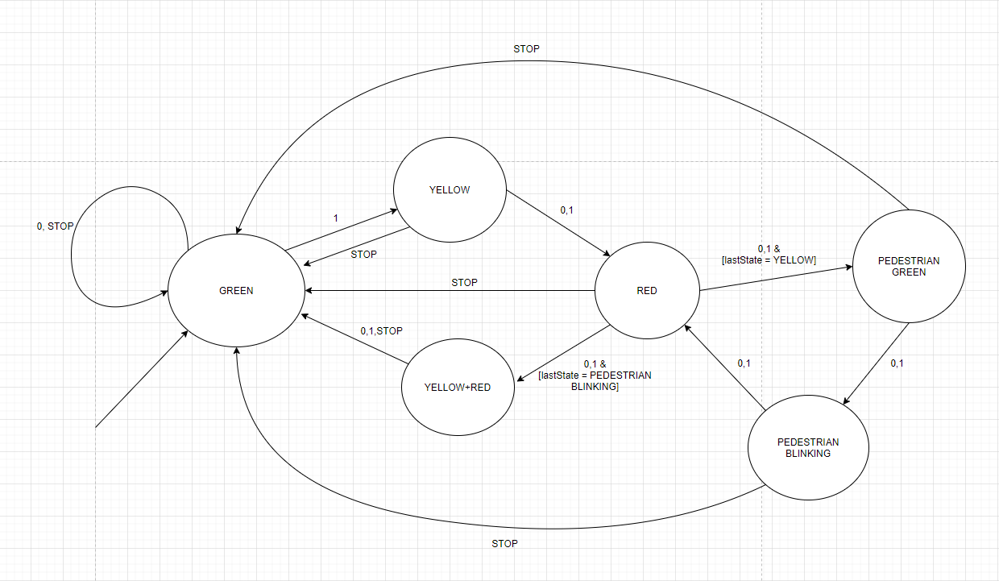

For the first "bigger" program, a traffic ligt system was implemented from a given working example.
The first task was to figure out and draw the state machine from the working example.
Afterwards a a recreation of the given example was coded in LabView based on the state machine model.

In reality, the stop button does not work as advertised. It wasn't until lab 3 when I figured out how to stop a while loop from inside one of its child control blocks in LabView.
