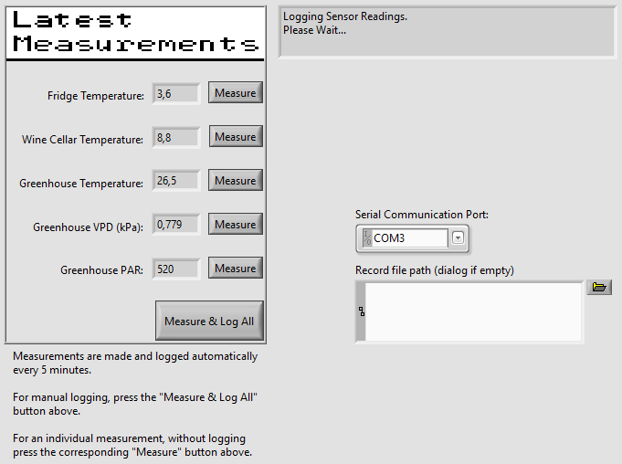

Lab 5 was a final project for the course. An imaginary home monitoring system was designed for the final project. It would include multiple different sensors all monitored by the LabView VI. The VI would periodically request the sensors' readings, display them and log them into an external file (Log.csv).
 
 
I decided to have the imaginary home contain a greenhouse, because I would be able to easily implement multiple different types of sensors (temperature, vapour-pressure deficit and photosynthetically active radiation sensors). In addition, the
home monitoring system would keep log of a wine cellar's temperature and a refridgerator's temperature.
 
 

 
 
The requesting of the sensor readings happens using UART to communicate with a centralized interface between the frontend VI and the backend. I decided to build a simulator with an LPC1549 microcontroller. The LPC code I used to simulate the retreival of the sensor reading is included in the LPC1549Code -directory.
 
 
The LPC interface works by receiving commands and sending back the corresponding sensor's reading. The commands that can be sent are:
 
 
"ft\n" - for reading in the fridge temperature
"wt\n" - for reading in the wine cellar temperature
"gt\n" - for reading in the greenhouse temperature
"gv\n" - for reading in the greenhouse VPD
"gp\n" - for reading in the greenhouse PAR
 
 
After sending the desired command, the LPC chip sends back the sensor reading. The simulation itself is rather dumb. The sensor's reading is chosen using a randomizing formula appropriate for the given sensor in the given environment. The randomizing formulas themselves don't take into consideration the time passed since the last performed measure nor the time of the day. For example, the PAR sensor, furthermore, the "normal environment" is an environment of normal greenhouse plant growth - not the ideal environment for growing seeds, for example).
 
 
However, ror testing the VI, the simulation is perfectly sufficient.
